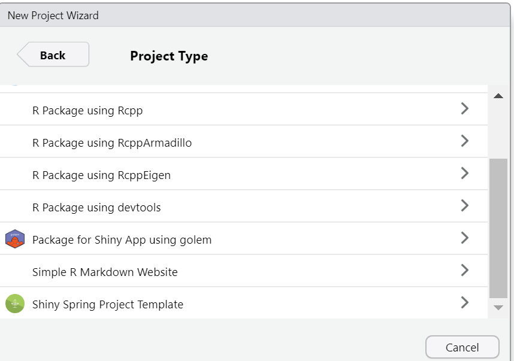
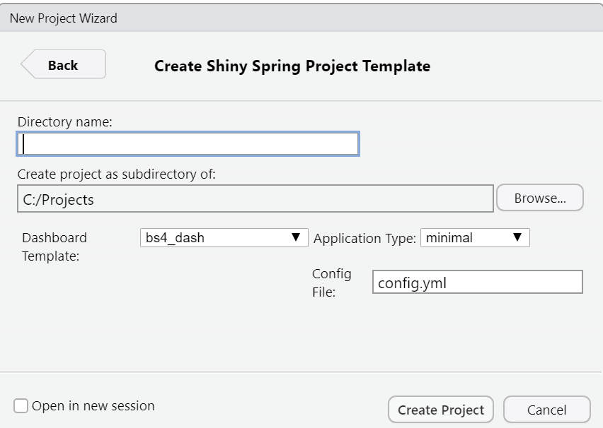

```{r setup, include=FALSE}
knitr::opts_chunk$set(
  collapse = TRUE,
  comment = "#>",
  fig.path = "man/figures/README-",
  out.width = "100%"
)
options(tibble.print_min = 5, tibble.print_max = 5)
```

# shinyspring <a href='https://www.shinyspring.dev'></a>

# <!-- badges: start --> [](https://cran.r-project.org/package=dplyr) [](https://github.com/tidyverse/dplyr/actions?workflow=R-CMD-check) [](https://codecov.io/gh/tidyverse/dplyr?branch=master)

<!-- badges: end -->

## Overview

shinyspring provides a development framework with templates based on bs4dash and more(to be added) .In collaboration with the {{sweetmods}}package shinyframework enables you to focus on core insights app that you want for your usebase.

A lot of peripheral modules related to *user authentication , filemanagement , Data explorations and several others* can added in a plug and play manner to build a complete robust shinyapp.

### New Project Creation in Rstudio

| Screen 1                                                     | Screen 2                                                     |
|--------------------------------------------------------------|--------------------------------------------------------------|
|  |  |

### New Project Creation : **Programmatically**

-   `shinyspring::create_new_project()` creates a new default project

    -    Options include : `shinyspring::create_new_project(dashboard_template = "bs4_dash" , app_type = "minimal" , config_file = "config.yml"`

    -   *dashboard_templates* : bs4_dash (available today) , future plans for shiny_dashboard and semantic_dashboard

    -   *app_type* : minimal (bare minimum app) , full (full app with all sweetmods visible) , demo_app (recreate the demo_app and customize for your needs)

## Steps to create a new app

-   Step 1 : Create a new project with Rstudio or in an empty project call `shinyspring::create_new_project()` this creates two file `config.yml` and `user_script.R`

-   Step 2 : open `user_script.R` and follow instructions . Instructions

    ```{r eval=FALSE}
    ## Start your Shiny Spring Journey here

    ## Step 1 : Make sure that your properties in config.yml are set as per your needs
    file.edit('config.yml')

    ## Step 2 : Create app.R for your application
    params <- config::get(file = "config.yml") # load params
    shinyspring::create_app_r(params = params )
    file.edit('app.R') # Adjust this to your app.R if you change the file


    ## Step 3 : Launch the App
    shiny::runApp()
    ```

-   Step 3 : This should be step 2, but most people want to see a live application before they go deep. So, now that you have seen the flow of building the app , you will want to investigate sweetmods. The power of shinyspring is in the reuse of sweetmods.

## FAQ's

-   Why Shinyspring ? What is the value add ?

-   Is Shinyspring robust and production ready ?

-   What is the development framework for Shinyspring ?

-   What are current modules available and what are the plans for future ?

-   How can I build modules that work with shiynspring ?

-   How can I contribute to shinyspring ?
